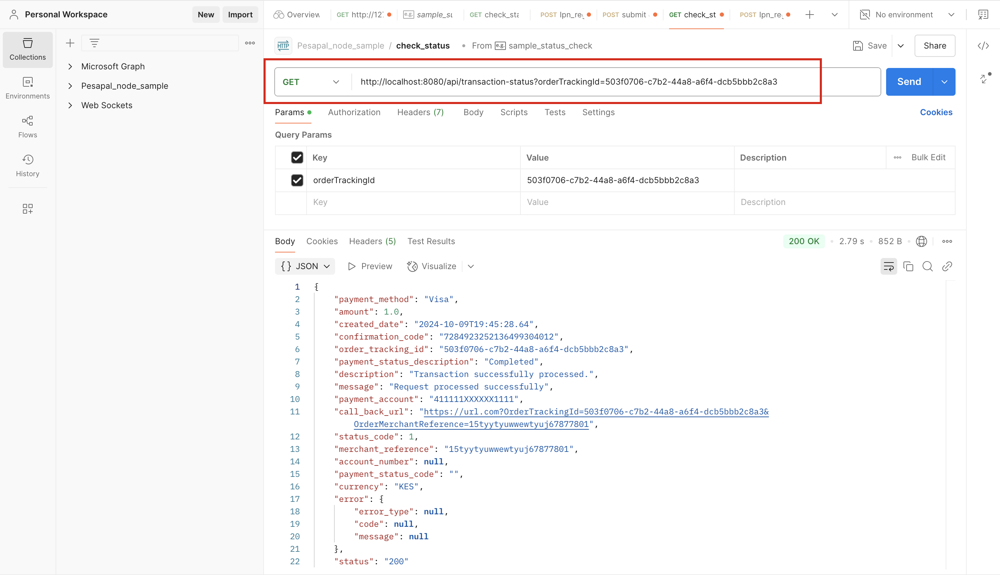

# Pesapal sample Spring Boot project

This is a simple [Spring Boot](https://spring.io/projects/spring-boot) project that integrates with the [Pesapal API](https://developer.pesapal.com/how-to-integrate/e-commerce/api-30-json/api-reference). The project was inspired by the [Node/Express version](https://github.com/Pesapal-Ltd/Sample_Api3_node/) that is provided by the Pesapal team.

## Prerequisites
Before you begin, ensure you have the following installed on your local machine:
- **Java (Preferably JDK 21)**
- **Git**

## Getting started
Follow these steps to set up and run the project locally:

### Clone the repository
The first step is to clone the project:

```bash
$ git clone https://github.com/chrischiedo/pesapal-api-spring-boot.git
```

### Run the application
You can then run the project by using the following commands:

```bash
$ cd pesapal-api-spring-boot
$ ./mvnw spring-boot:run
```

>**Note**: By default, this sample project is using Kenyan demo keys. Feel free to switch to any other keys of the country of your choice from this link:
https://developer.pesapal.com/api3-demo-keys.txt

You can change the demo keys from the `application.properties` file.

## Sample API call using Postman
Here is a screenshot showing the result of a GET request for a `Transaction Status`:

Endpoint: http://localhost:8080/api/transaction-status?orderTrackingId=xxxxxx



## Official Pesapal API Reference
For an in-depth documentation on Pesapal API 3.0 integration, please refer to the following link:

https://developer.pesapal.com/how-to-integrate/e-commerce/api-30-json/api-reference
